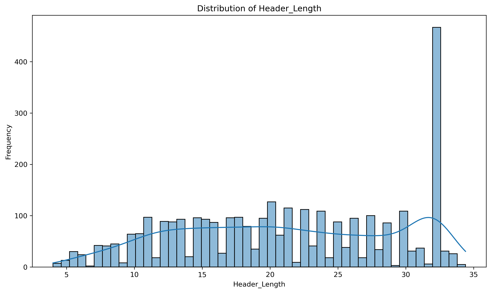
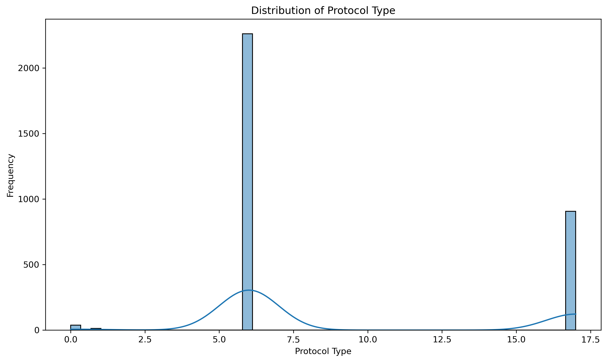
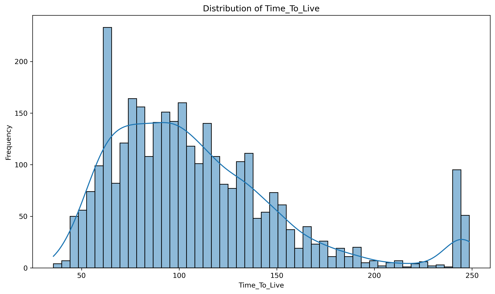
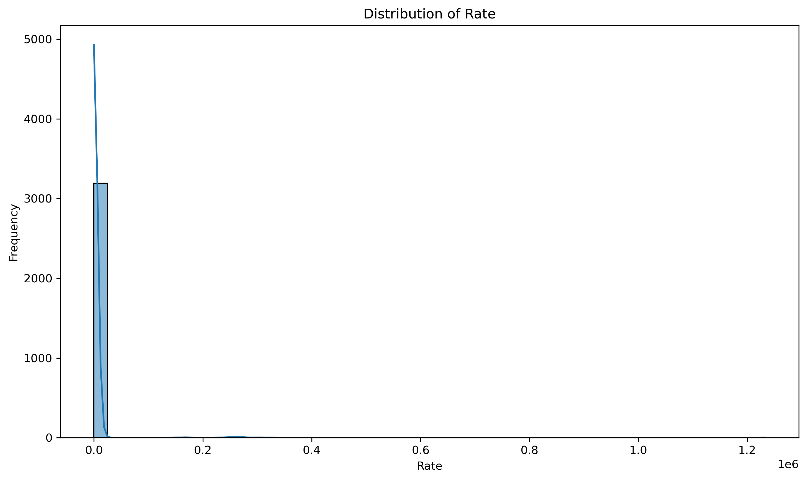
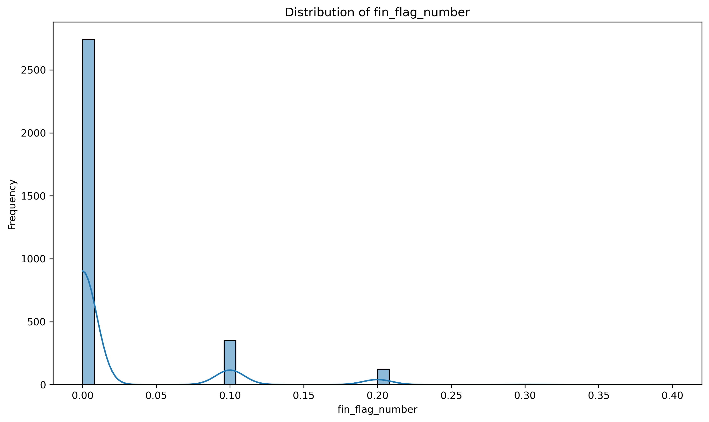
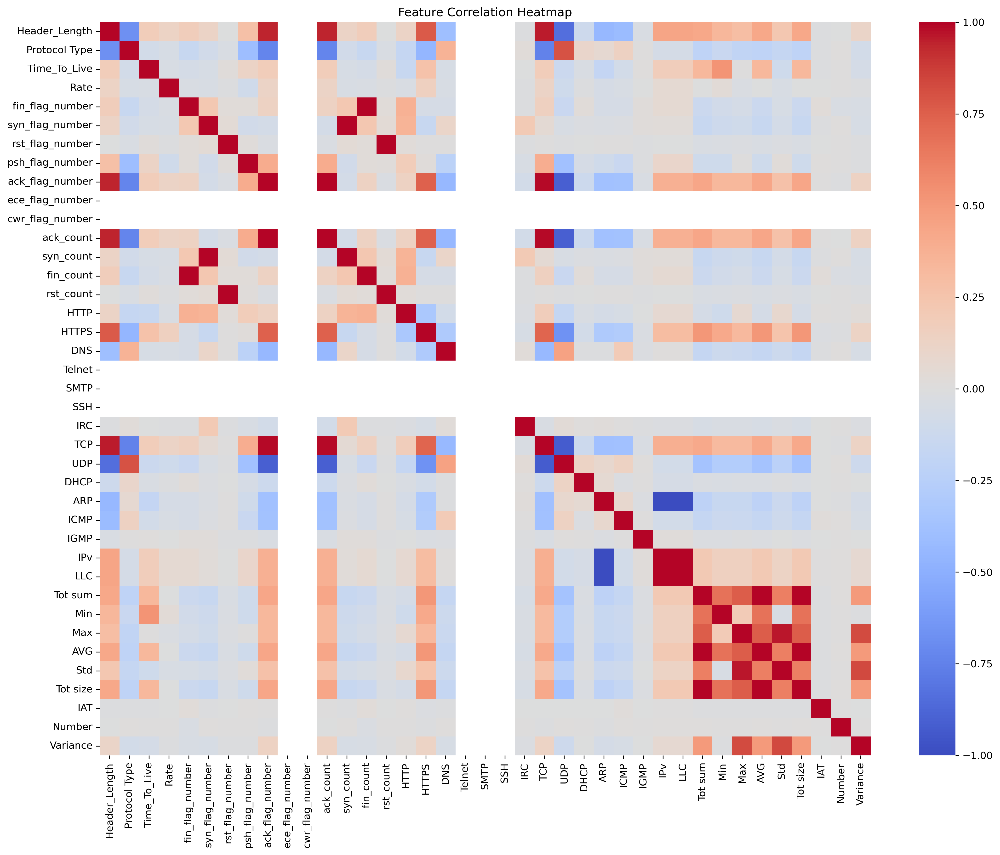

# Backdoor Malware Dataset Analysis Report

**Generated on:** 2025-06-27 20:00:59

## Dataset Overview

- **Dataset Shape:** 3218 rows × 39 columns
- **File Path:** `../../../data/Backdoor_Malware/Backdoor_Malware.pcap.csv`
- **Missing Values:** 0 total missing values

## Dataset Information

### Basic Statistics
- **Total Records:** 3,218
- **Total Features:** 39
- **Memory Usage:** 0.96 MB

### Data Types Distribution
- **float64:** 30 columns
- **int64:** 9 columns

### Missing Values Summary
✅ No missing values found in the dataset.

## Data Visualizations

### Feature Distributions

#### Header_Length

#### Protocol Type

#### Time_To_Live

#### Rate

#### fin_flag_number

### Feature Correlation Analysis

## Statistical Summary

### Key Numeric Features Summary
| Feature | Mean | Std | Min | Max |
|---------|------|-----|-----|-----|
| Header_Length | 21.0175 | 7.8722 | 4.0000 | 34.4000 |
| Protocol Type | 9.0059 | 5.0562 | 0.0000 | 17.0000 |
| Time_To_Live | 108.9486 | 45.6627 | 35.6000 | 248.6000 |
| Rate | 2891.9642 | 30984.4099 | 0.0104 | 1233618.8235 |
| fin_flag_number | 0.0188 | 0.0487 | 0.0000 | 0.4000 |
| syn_flag_number | 0.0284 | 0.0600 | 0.0000 | 0.4000 |
| rst_flag_number | 0.0017 | 0.0157 | 0.0000 | 0.4000 |
| psh_flag_number | 0.1987 | 0.1666 | 0.0000 | 0.9000 |
| ack_flag_number | 0.5833 | 0.3078 | 0.0000 | 1.0000 |
| ece_flag_number | 0.0000 | 0.0000 | 0.0000 | 0.0000 |

## Key Insights

1. **Dataset Size:** The dataset contains 3,218 records with 39 features, suitable for machine learning analysis.

2. **Data Quality:** ✅ Clean dataset with no missing values

3. **Feature Types:** 
   - Numeric features: 39
   - Categorical features: 0

4. **Potential for Analysis:** This dataset appears well-suited for:
   - Anomaly detection using PyOD
   - Classification tasks
   - Network security analysis
   - IoT malware detection

## Recommendations for PyOD Analysis

1. **Preprocessing Steps:**
   - Consider feature scaling/normalization
   - Handle categorical variables if needed
   - Remove highly correlated features if necessary

2. **Suitable PyOD Algorithms:**
   - Isolation Forest
   - Local Outlier Factor (LOF)
   - One-Class SVM
   - AutoEncoder-based methods

3. **Evaluation Strategy:**
   - Use the label column for evaluation (if available)
   - Apply train-test split
   - Consider cross-validation for robust results

## Files Generated

- `dataset_info.txt` - Basic dataset information
- `summary_statistics.csv` - Statistical summary
- `missing_values.csv` - Missing values analysis
- `categorical_analysis.txt` - Categorical features analysis
- `first_5_rows.csv` - Sample data preview
- Various PNG files for visualizations

---
*Report generated using automated analysis script*
