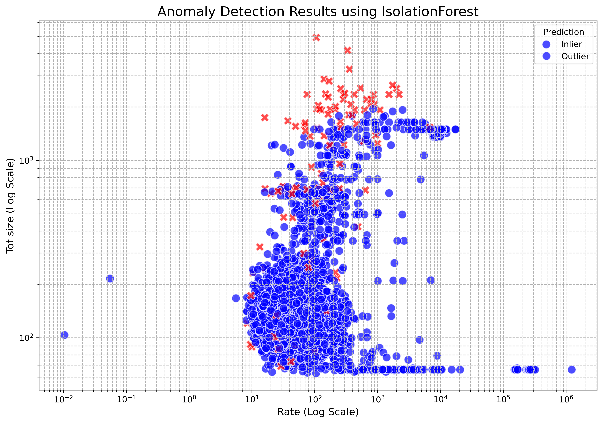
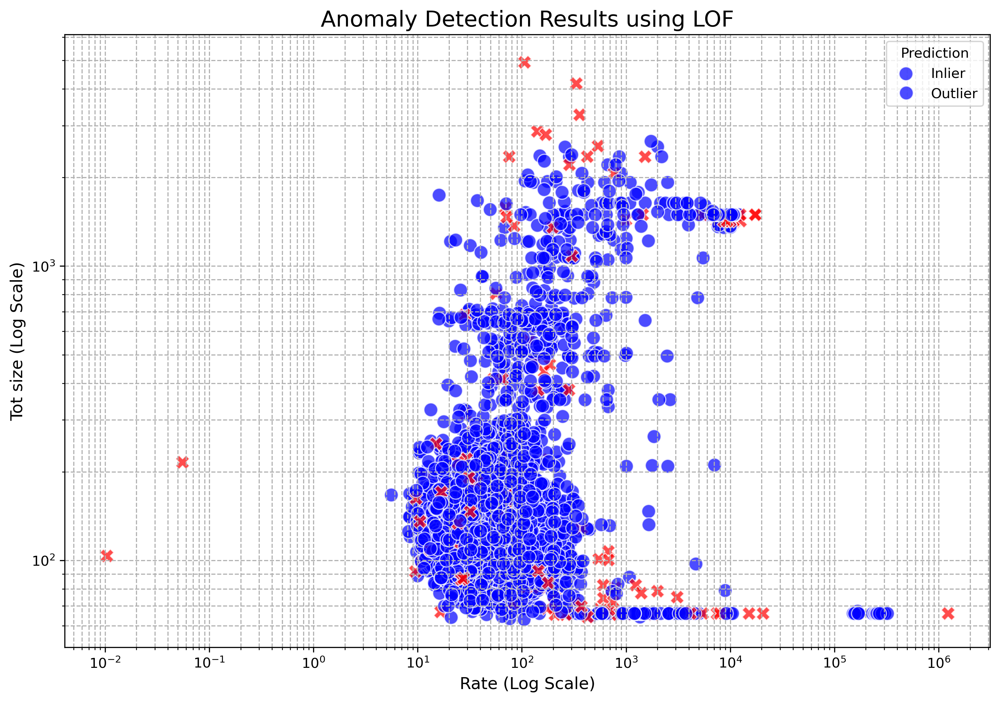
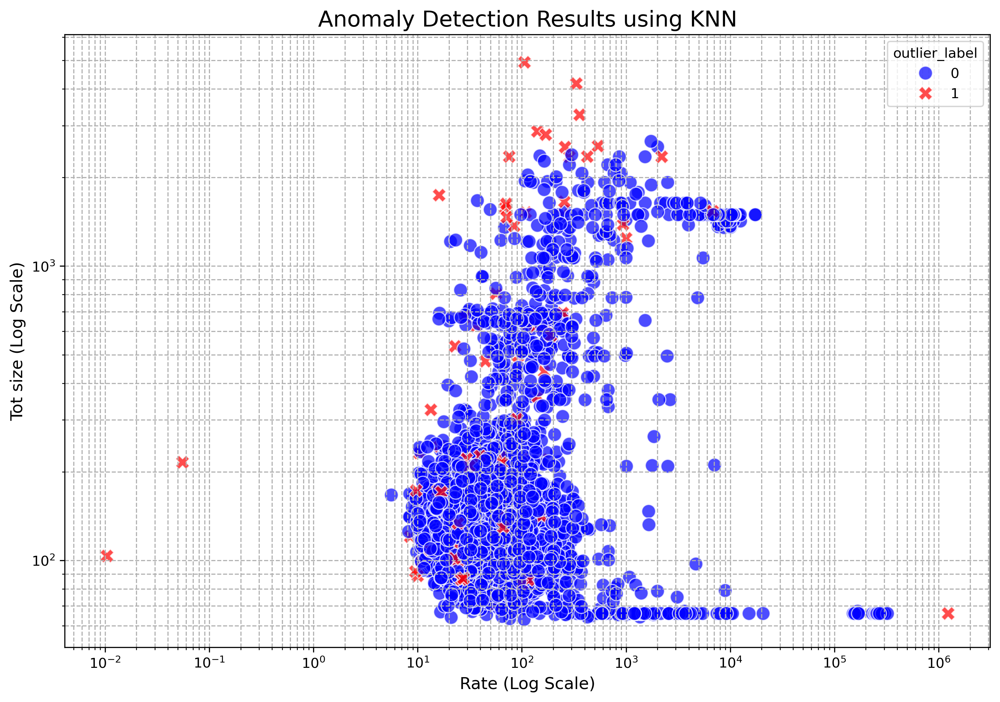

# Comprehensive Anomaly Detection Report

## IsolationForest

### Overview
- Total data points: 3218
- Detected outliers: 161
- Contamination rate: 5.0031%

### Visualization
{ width=600px }

### Artifacts
- [Predictions CSV](predictions_IsolationForest.csv)
- [Text report](summary_report_IsolationForest.txt)

### Statistical Summaries
- Inlier score mean: -0.0880, std: 0.0342
- Outlier score mean: 0.0332, std: 0.0297

### Top 5 Most Anomalous Points
|      |   anomaly_score |
|-----:|----------------:|
|  272 |        0.134584 |
|  618 |        0.129274 |
| 1324 |        0.126925 |
|  115 |        0.119369 |
| 2600 |        0.102811 |

## LOF

### Overview
- Total data points: 3218
- Detected outliers: 161
- Contamination rate: 5.0031%

### Visualization
{ width=600px }

### Artifacts
- [Predictions CSV](predictions_LOF.csv)
- [Text report](summary_report_LOF.txt)

### Statistical Summaries
- Inlier score mean: 1.0897, std: 0.1189
- Outlier score mean: 3.9057, std: 5.2637

### Top 5 Most Anomalous Points
|      |   anomaly_score |
|-----:|----------------:|
|  944 |         34.0908 |
| 1249 |         24.9757 |
| 1012 |         24.2089 |
|  927 |         22.2564 |
| 1224 |         21.9304 |

## KNN

### Overview
- Total data points: 3218
- Detected outliers: 161
- Contamination rate: 5.0031%

### Visualization
{ width=600px }

### Artifacts
- [Predictions CSV](predictions_KNN.csv)
- [Text report](summary_report_KNN.txt)

### Statistical Summaries
- Inlier score mean: 1.4408, std: 0.7688
- Outlier score mean: 6.0460, std: 6.6041

### Top 5 Most Anomalous Points
|      |   anomaly_score |
|-----:|----------------:|
| 3217 |         56.7556 |
|  927 |         55.7658 |
| 2001 |         30.8562 |
|  997 |         28.465  |
| 2891 |         18.5361 |

## AutoEncoder

### Overview
- Total data points: 3218
- Detected outliers: 161
- Contamination rate: 5.0031%

### Visualization
{ width=600px }

### Artifacts
- [Predictions CSV](predictions_AutoEncoder.csv)
- [Text report](summary_report_AutoEncoder.txt)

### Statistical Summaries
- Inlier score mean: 3.2550, std: 1.2553
- Outlier score mean: 11.2495, std: 6.5634

### Top 5 Most Anomalous Points
|      |   anomaly_score |
|-----:|----------------:|
| 3217 |         56.7863 |
|  927 |         56.1826 |
| 2001 |         39.7269 |
| 2891 |         35.985  |
|  997 |         26.5697 |

